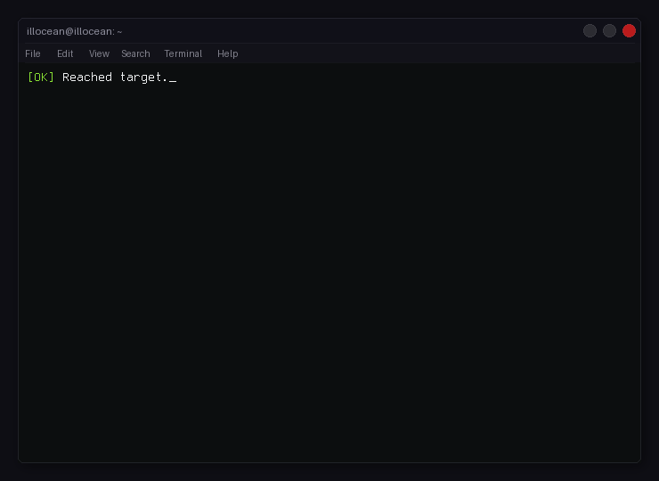

<div align="center">

# Terminal GIF for GitHub Profile

**An animated terminal GIF showcasing your GitHub stats — best-effort scheduled generation, with a manual Actions fallback.**



[](https://github.com/dbuzatto/gif-terminal/stargazers)
[](https://github.com/dbuzatto/gif-terminal/network/members)
[](LICENSE)

</div>

---

## Features

- Fetches **live GitHub stats** (repos, commits, stars, PRs, issues, followers, languages) only when the complete API read succeeds
- **Three themes** — classic terminal, macOS Liquid Glass, or Debian GNOME
- **Username auto-detected** — no code editing needed after forking
- **Best-effort scheduled regeneration** via GitHub Actions, with a manual Actions fallback
- Easy to set up: fork → optionally choose a theme → run the workflow

---

## Themes

| Value | Theme | Description |
|-------|-------|-------------|
| `default` | **Classic dark** *(default)* | Clean dark terminal, no wallpaper |
| `macos` | **macOS Liquid Glass** | Frosted glass terminal floating over a macOS wallpaper, with traffic-light buttons |
| `debian` | **Debian GNOME** | Classic GNOME 2 terminal with title bar, menu bar, and Tango colors over the Debian wallpaper |

---

## Quick Start (fork & use)

### 1. Fork this repository

Click the **Fork** button at the top right of this page.

### 2. No token setup required

The workflow uses GitHub's automatic `GITHUB_TOKEN` to read public repository data and publish `output.gif`. Do not add `GH_TOKEN` or another repository secret.

> GitHub may disable scheduled workflows in inactive public forks. If that happens, enable Actions and run **Generate Terminal GIF** manually from the Actions tab.

### 3. Choose your theme (optional)

Go to **Settings → Secrets and variables → Actions**, open the **Variables** tab and click **New repository variable**:

| Name | Value |
|------|-------|
| `THEME` | `macos` or `debian` or `default` |

> If you skip this step the `default` theme (classic dark terminal, no wallpaper) is used.

### 4. (macOS / Debian themes) Add your wallpaper

| Theme | File to replace |
|-------|----------------|
| `macos` | `assets/macos_wallpaper.jpg` |
| `debian` | `assets/debian_wallpaper.png` |

Replace the file in `assets/` with your own image. Any resolution works — it will be cropped to fit automatically.

### 5. Trigger the first run

Go to **Actions → Generate Terminal GIF → Run workflow** to generate your first GIF immediately, or rely on the best-effort daily schedule (06:00 UTC). If the schedule is disabled, use the manual Actions fallback from the Actions tab.

### 6. Add to your profile README

```markdown

```

---

## Running Locally

### Install dependencies

```bash
python -m pip install --require-hashes --requirement requirements.txt

# Install ffmpeg (macOS)
brew install ffmpeg

# Install ffmpeg (Ubuntu / Debian)
sudo apt install ffmpeg
```

> **No ffmpeg?** The `default` and `debian` generators include a Pillow fallback. The macOS generator requires a working FFmpeg installation. GitHub Actions installs FFmpeg.

### Configure your GitHub Token and username

```bash
cp .env.example .env
```

Edit `.env` and fill in a non-empty GitHub token with read access to public profile data. The generators fail rather than render incomplete or placeholder stats. `GIT_USERNAME` is optional when the script runs in GitHub Actions; local runs can use the detected owner fallback.

```env
GITHUB_TOKEN=your_token_here
GIT_USERNAME=your_github_username   # required for local runs
```

> On GitHub Actions, `GITHUB_TOKEN` is supplied automatically and the username is auto-detected. Both environment values are only needed for local runs.

After generating locally, run the same validation used by CI:

```bash
python scripts/validate_gif.py output.gif
```

### Generate the GIF

```bash
# macOS Liquid Glass theme
python generate_liquid_glass.py

# Debian GNOME theme
python generate_debian.py

# Classic dark theme
python generate_with_stats.py
```

The output is saved as `output.gif`.

---

## Project Structure

```
.
├── generate_liquid_glass.py      # macOS Liquid Glass theme
├── generate_debian.py            # Debian GNOME theme
├── generate_with_stats.py        # Classic dark theme
├── profile_content.py            # Shared profile categories
├── github_stats.py               # Shared fail-closed GitHub stats adapter
├── assets/
│   ├── macos_wallpaper.jpg       # Wallpaper for macOS theme
│   └── debian_wallpaper.png      # Wallpaper for Debian theme
├── requirements.txt               # Hashed Python dependency lock
├── output.gif                    # Generated GIF (auto-updated by CI)
├── .env.example                  # Environment variable template
└── .github/
    └── workflows/
        └── generate-gif.yml      # Unified CI workflow (theme selected via THEME variable)
```

---

## Customization

### Username
The username is **automatically detected** from your GitHub account — no code changes needed.
When running locally, you can override it with:
```bash
GIT_USERNAME=your-username python generate_liquid_glass.py
```

### Profile categories
All three generators use the shared `github_stats.py` adapter and render the profile categories from `profile_content.py`. Edit that file to change the shared profile content; edit a generator only for theme-specific layout.

### Theme-specific settings

**macOS Liquid Glass** (`generate_liquid_glass.py`)
- Wallpaper → replace `assets/macos_wallpaper.jpg`
- Glass opacity → `frosted_title` / `frosted_content` overlay alpha in `prepare_glass_layers()`
- Text colors → `ConvertAnsiEscape.ANSI_ESCAPE_MAP_TXT_COLOR` at the top of the file

**Debian GNOME** (`generate_debian.py`)
- Wallpaper → replace `assets/debian_wallpaper.png`
- Glass darkness → `tint_rgba` values in `prepare_debian_layers()`
- Text colors → `ConvertAnsiEscape.ANSI_ESCAPE_MAP_TXT_COLOR` at the top of the file
- Window layout → `TITLE_H`, `MENU_H`, `CORNER_RADIUS` constants

---

## Contributing

Contributions, issues, and feature requests are welcome.
Feel free to open an [issue](../../issues) or submit a pull request.

---

<div align="center">

If this project helped you, consider leaving a ⭐

</div>
